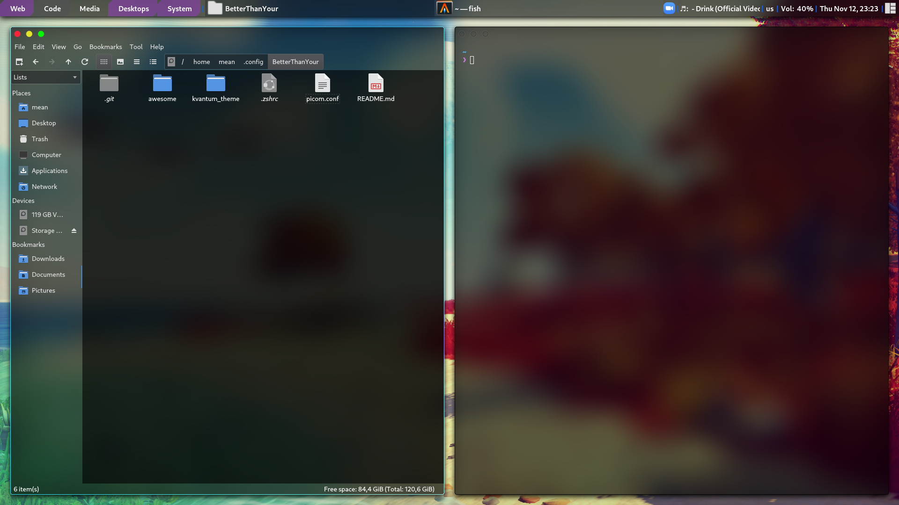

# "BetterThanYour" dotfiles

<!-- Images of desktop -->


## A minimal theme for AwesomeWM

Main goal here was to keep the rc file as sort as possible, while providing decent astheics. 

It is still work in progress.

## How to install
### Dependancies
  * AwesomeWM
  * Kvantum   : to select tranparent theme
  * picom     : to have blur & fade effects on windows
  * playerctl : to control music
  * maim      : to take screenshots
  * i3lock    : to have lock screen
  * qt5ct     : to set Qt themes
  * nitrogen  : to set wallpaper
  * Cantrella, Cascadia fonts

Obviously you can replace some of these programs with the ones of your choice but have to modify the rc file accordingly

After installing the dependacies run
```bash
git clone https://github.com/codiac-killer/BetterThanYour.git ~/.config
ln -s ~/.config/BetterThanYour/awesome ~/.config
ln -s ~/.config/BetterThanYour/picom.conf ~/.config
ln -s ~/.config/BetterThanYour/kvantum_theme ~/.config/Kvantum/BetterThanYour
```

_If the last command fails its because you haven't used Kvantum yet_

```c
if (last line failed){
	Launch Kvantum
	Click: "Select a Kvatum theme folder"
	Go to ~/.config/BetterThanYour/kvatum_theme
	Click open
}
```

In Kvantum change into the newly added theme.

That's it! (Re)start Awesome and you are ready.

## Things to come / TODO list
  * Shutdown/Logout screen - currently use right click menu to shutdown
  * Make wibar not look so bloated<sup>TM</sup>
